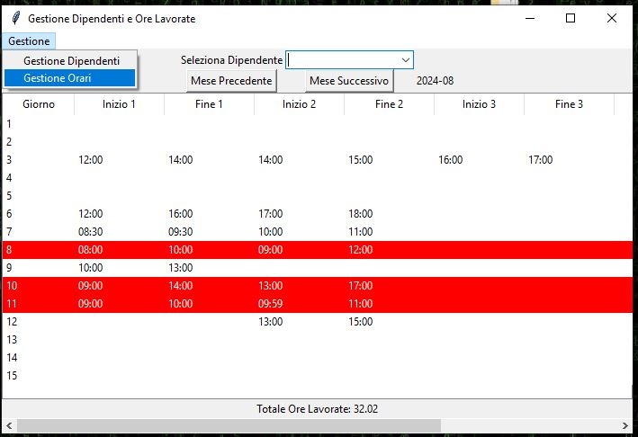
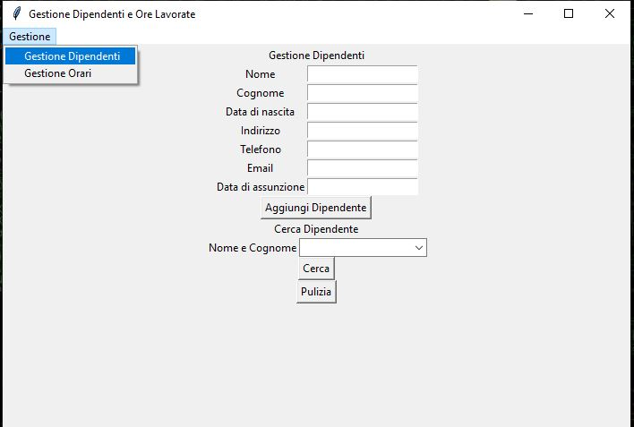

# Tkinter

Esempio di gestionale dipendenti usando mysql e tkinter con la possibilità di aggiungere-rimuovere dipendenti
e gestire i loro orari mensili, e rilevando incongruenze nell'inserimento degli orari in rosso.

